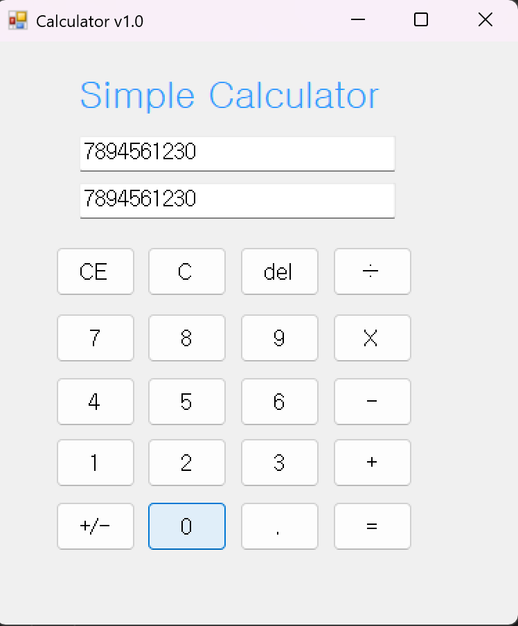
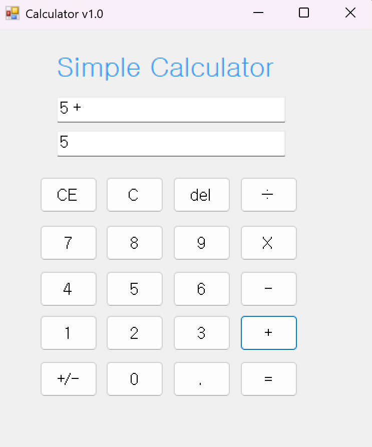
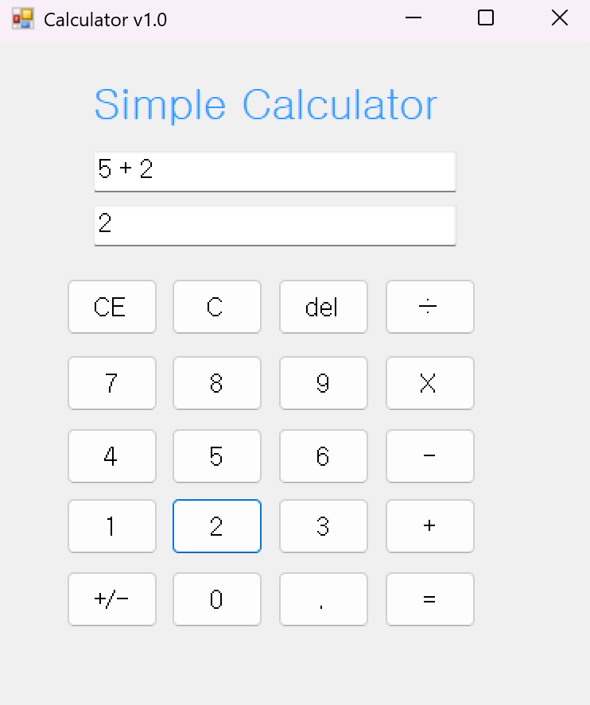
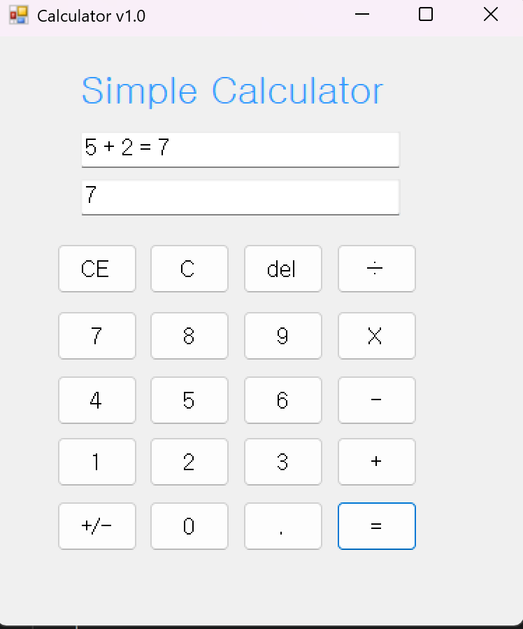

## (C# 코딩) 
심플 사칙연산기

## 개요
- C# 프로그래밍 학습
- 1줄 소개: 사용자 입력을 받아 사칙연산 결과를 계산하고 화면에 출력하는 C# Windows Forms 계산기 프로그램
- 사용한 플랫폼:
	- C#, .NET Windows Forms, Visual Studio, GitHub
- 사용한 컨트롤:
	- Label → 계산기 제목 표시
	- TextBox → 입력 숫자 및 계산 결과 표시 (inputNumBox, outputNumBox)
	- Button → 숫자 입력 및 연산 기능 수행
	
- 사용한 기술과 구현한 기능:
	- Visual Studio를 이용하여 UI 디자인함
	- ToString() 메서드를 사용하여 계산 결과를 문자열로 변환 후 TextBox에 출력
	- int.Parse()를 사용하여 TextBox의 문자열 데이터를 정수형(int)으로 변환하여 계산 수행

- 수업 중에 배우고 사용했던 클래스들 관련된 설명
	- 

- 실습 중에 구현한 기능들 설명
	-  

## 실행 화면 (과제1)

- 과제1 코드의 실행 스크린샷
	- 숫자 누르면 (여러 개를 눌러도) 입력값이 표시됨

- 과제1 코드의 실행 스크린샷2
	- 연산자 버튼 누르면 inPutNumBox에 표시
	- Operand(피연산자)가 하나씩 표시됨

- 과제1 코드의 실행 스크린샷3
	- Operand(피연산자)가 하나씩 표시됨

- 과제1 코드의 실행 스크린샷4
	- = 버튼 누르면 계산 결과가 outputNumBox에 최종적으로결과값만표시 표시됨
	
- 과제 내용
	- Label, TextBox, Button 컨트롤을 활용하여 계산기 UI를 구성
	- 숫자 버튼 클릭 시 TextBox(inputNumBox)에 입력값이 표시되도록 구현.
	- +(btnPlus) 버튼 클릭 시 첫 번째 피연산자와 연산자를 저장.
	- 등호 버튼(btnEqual) 클릭 시 두 번째 피연산자를 입력받아 사칙연산 결과를 계산.
	- 계산 결과를 TextBox(outputNumBox)에 출력하여 사용자에게 표시.

- 구현 내용과 기능 설명
	- 입력창에 숫자 버튼을 클릭하면 해당 숫자가 inputNumBox에 표시됨
	- 사칙연산중 + 기능 구현
	- inputNumBox는 모든 내용을 표시하며 종이에 식을 풀어나가는것과 유사함
	- outputNumBox는 계산 결과만 표시되고 전자 계산기의 결과창과 유사함